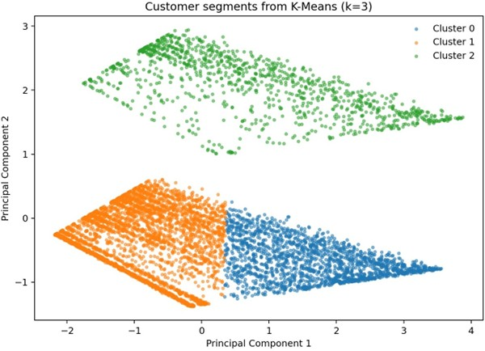

# Customer Segmentation using Unsupervised Learning

Segmented 7,043 telecom customers into 3 actionable groups using unsupervised learning, revealing a high-risk segment with approximately 3x higher churn than the most stable segment.

## Project Structure

```text
telco-customer-segmentation/
├── README.md
├── notebooks/
│   └── telco_unsupervised_segmentation.ipynb
├── src/
│   └── telco_unsupervised_segmentation.py
├── reports/
│   └── unsupervised_telco_segmentation_report.pdf
├── images/
│   └── telco_clusters_pca.png
├── data/                       # optional, or exclude with .gitignore
└── requirements.txt
```

## Problem

Many churn analyses treat customers as one uniform population. That is a weak assumption. Customers behave differently, spend differently, and leave for different reasons.

The goal of this project was to identify meaningful customer segments in the Telco Customer Churn dataset so that retention strategies can be targeted by group rather than applied blindly across the whole customer base.

## Dataset

- **Source:** Telco Customer Churn dataset
- **Records:** 7,043 customers
- **Features used for clustering:**
  - `tenure`
  - `MonthlyCharges`
  - `TotalCharges`
  - `SeniorCitizen`

Although the dataset includes a `Churn` variable, it was **not** used to create the clusters. It was used only afterwards to interpret the business relevance of each segment.

## Approach

### Preprocessing
- Converted `TotalCharges` to numeric
- Removed rows with missing `TotalCharges`
- Standardised numeric features using `StandardScaler`

### Models compared
- **K-Means:** k = 3, 4, 5
- **Hierarchical clustering:** Ward linkage, k = 3, 4
- **DBSCAN:** eps = 0.5, 0.7

### Evaluation metric
- **Silhouette score**, used to compare cluster separation and cohesion

## Model Comparison

| Model | Silhouette Score |
|---|---:|
| K-Means (k=3) | 0.464 |
| K-Means (k=4) | 0.427 |
| K-Means (k=5) | 0.452 |
| Hierarchical (Ward, k=3) | 0.431 |
| Hierarchical (Ward, k=4) | 0.360 |
| DBSCAN (eps=0.5) | 0.361 |
| DBSCAN (eps=0.7) | 0.415 |

## Model Selection

**K-Means with 3 clusters** was selected as the final model because it achieved the highest silhouette score and produced the clearest and most interpretable customer segments.

## Key Findings

### 1. Established premium customers
- **Customers:** 1,875
- **Average tenure:** 57.24 months
- **Average monthly charges:** 88.63
- **Average total charges:** 5,056.32
- **Churn rate:** 14%
- **Typical contract:** Two year

### 2. Lower-spend newer customers
- **Customers:** 4,015
- **Average tenure:** 20.58 months
- **Average monthly charges:** 49.40
- **Average total charges:** 838.36
- **Churn rate:** 28%
- **Typical contract:** Month-to-month

### 3. Higher-risk senior customers
- **Customers:** 1,142
- **Average tenure:** 33.30 months
- **Average monthly charges:** 79.82
- **Average total charges:** 2,810.47
- **Churn rate:** 42%
- **Typical contract:** Month-to-month

## Business Impact

- **Higher-risk senior customers (42% churn):** immediate priority for retention campaigns, simpler offers, and contract incentives
- **Lower-spend newer customers (28% churn):** onboarding and early-lifecycle engagement should be improved to reduce avoidable churn
- **Established premium customers (14% churn):** loyalty protection matters more than aggressive intervention

The main business point is simple: **customer churn risk is not uniform**, so retention strategy should not be uniform either.

## Visualisation

The PCA projection below shows the final K-Means segmentation in two dimensions for communication purposes.



## Limitations

This clustering workflow used a reduced numeric feature set to keep the analysis interpretable and computationally efficient. That improves clarity, but it likely ignores useful behavioural information from categorical variables such as service bundles, contract details, and payment behaviour during cluster formation.

## Next Steps

- Add encoded categorical variables to the clustering feature set
- Compare additional clustering methods such as Gaussian Mixture Models
- Test cluster stability across repeated samples
- Measure downstream business outcomes by segment, such as campaign response or retention lift

## Files in this Repository

- **Notebook:** step-by-step analysis in Jupyter
- **Python script:** clean script version of the workflow
- **Report:** stakeholder-facing summary of the project
- **PCA image:** visual summary of the final segmentation

## How to Run

```bash
pip install -r requirements.txt
jupyter notebook notebooks/telco_unsupervised_segmentation.ipynb
```
